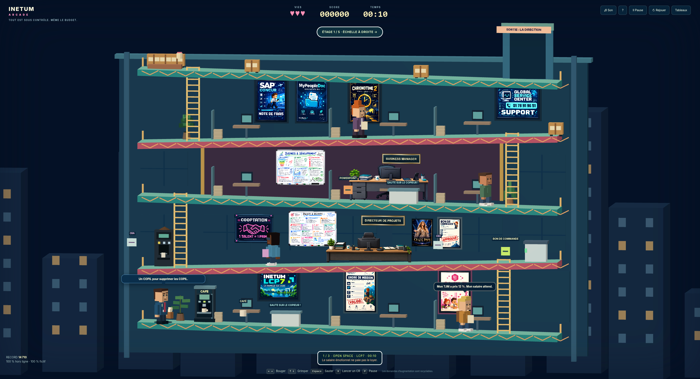

# Hors Budget

**Un Directeur de Projets. Une quête épique. Un budget Excel.**

Petit jeu d’arcade en vue de côté, dans une version satirique d’INETUM. Tu incarnes le **Directeur de Projets**. Le budget s’est perdu quelque part entre l’open space et le Power UP Tour, où le prochain atelier dure six heures. Les salariés attendent une augmentation : à toi de remonter sa piste, de traverser la direction et de débloquer le budget pour tout le monde.

Le parcours suit trois étapes : les premiers indices dans l’open space LCP7, l’accès au rooftop gardé par le **Directeur Technologies Services Pays de la Loire**, puis le budget détenu par le **Directeur Région Grand Ouest** au séminaire.

## Jouer directement

**[Lancer Hors Budget dans le navigateur](https://c0sm0cats.github.io/hors-budget/)** — aucun téléchargement ni installation.

## Jouer hors ligne

Télécharge le dépôt avec **Code → Download ZIP**, décompresse-le, puis ouvre **index.html** par double-clic.

Le jeu est autonome : HTML, CSS, JavaScript, rendu WebGL, images PNG et sons synthétisés. Aucun serveur, installation, framework, fichier audio ni appel réseau. Utilise un navigateur récent avec WebGL activé (Chrome, Edge ou Firefox).

## Commandes

| Action | Clavier |
| --- | --- |
| Marcher | ← → ou Q / D (A / D également) |
| Grimper | ↑ ↓ ou Z / S (W / S également) |
| Sauter | Espace — maintenir pour sauter plus haut |
| Lancer un compte rendu / renvoyer un dossier | X |
| Pause | P ou Échap |

Des commandes tactiles sont disponibles sur petit écran.

## Les trois zones

- **Open Space · LCP7** : retrouve les premiers indices sur le budget parmi les consultants, les commerciaux et les outils du quotidien.
- **Direction TS · Pays de la Loire** : renvoie les KPI du Directeur Technologies Services Pays de la Loire pour ouvrir l’accès au rooftop.
- **Power UP Tour · Grand Ouest** : affronte le Directeur Région Grand Ouest et débloque le budget pour tous les salariés.

## Au programme

- Des consultants et des équipes business, avec leurs tenues et leurs répliques.
- Des bureaux remplis de références et de tableaux à découvrir.
- Des échelles, photocopieurs, buffets et un ascenseur pour trouver des raccourcis.
- Des comptes rendus à lancer, des projectiles à renvoyer et deux boss.
- Café, bon de commande et PowerPoint comme bonus.
- Chronos, médailles et défis à débloquer.

L’objectif reste le même tout au long de la partie : **remonter la piste du budget → ouvrir l’accès au rooftop → débloquer le budget pour tous**.

> **TOUT EST SOUS CONTRÔLE. MÊME LE BUDGET.**

Scores et palmarès sont stockés uniquement dans le navigateur (`localStorage`), lorsqu’il l’autorise. Ils ne sont pas synchronisés entre navigateurs ou appareils.

## Technique

Le jeu est écrit sans framework. `index.html` charge directement `game.js` et les modules des décors, personnages et dialogues. Les styles se trouvent dans `style.css` et `polish.css`.

Le rendu adapte automatiquement certains effets aux appareils plus modestes et respecte `prefers-reduced-motion` pour limiter les animations non essentielles.

Personnages et situations fictifs ; satire des clichés du conseil informatique.
